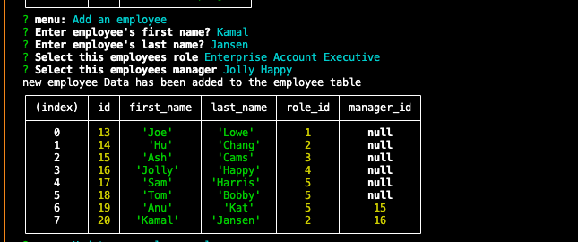
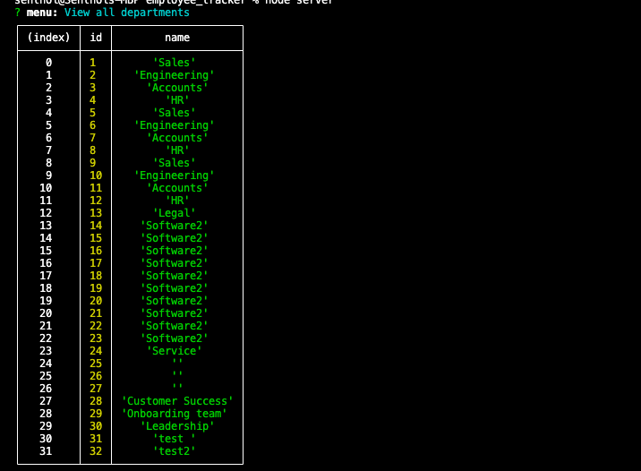

# Employee Tracker

## Description

This is a command line application to help manage company's employee database. From different departments, roles, to employee information all in one application! You

## Usage and Demo

Click [here](https://drive.google.com/file/d/1Qh0W9LmmvQRHwqZN5xHCOU2-z52WzBZK/view) for video Demo.

Screen Shots

- 
- 

## Table of Contents

- [Description](#description)
- [Usage and Demo](#usage-and-demo)
- [Installation](#installation)
- [License](#license)
- [Technology Used](#technology-used)
- [Questions](#questions)

## Installation

Git clone, in the terminal npm init and npm install inquirer. To run npm server.js

## License

Licensed under MIT License.

## Technology Used

- JavaScript
- NodeJs
- inquirer
- MySql

## Questions

- GitHub: https://github.com/katochsenthal
- Email: katoch.senthal@gmail.com
